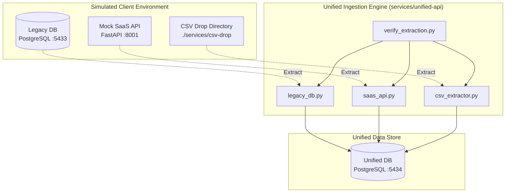

# MessyData: Enterprise CRM Consolidation Platform

[](#)

MessyData is a multi-source data integration platform built to simulate and solve the "integration wall" commonly encountered in real-world enterprise deployments. Instead of assuming clean data pipelines, this project implements a production-grade ingestion and reconciliation engine to consolidate fragmented and corrupted customer records across three disconnected sources.

---

## 1. CRM Consolidation Scenario

A fictional enterprise has acquired a competitor and needs to reconcile customer profiles across three disparate systems:

1. **Legacy CRM (PostgreSQL)**
   * **Attributes**: A denormalized database with inconsistent capitalization, transposed name components (e.g., `LAST, FIRST`), duplicates, and missing (`NULL`) email fields.
2. **Modern SaaS CRM (REST API)**
   * **Attributes**: A cloud REST CRM with paginated results, sliding-window rate limiting, intermittent internal server errors, and domain-drifted emails (e.g., corporate vs. public webmails).
3. **Sales Team CSV Exports**
   * **Attributes**: Hand-maintained spreadsheets from regional divisions containing spelling mistakes, different date formats (e.g., `MM/DD/YYYY` vs. `DD-MM-YYYY`), varying header names, and alternative encodings (e.g., Latin-1/Windows-1252 with accented characters like René and Zoë).

The objective is to ingest, clean, fuzzy-match, and load these records into a single queryable **Unified Database** of customer profiles, retaining an audit trail for data lineage.

---

## 2. System Architecture (Phases 1 & 2)

The architecture diagram below displays the completed data generation and extraction flow as of **Phase 2**:



---

## 3. Directory Structure

```text
MessyData/
├── docker-compose.yml                 # Orchestrates all multi-container services
├── README.md                          # [THIS FILE] Project overview & documentation
├── docs/                              # Project PRD and Phase breakdowns
│   ├── MessyData_PRD.txt
│   ├── phase1_explanation.md
│   └── phase2_explanation.md
├── scripts/
│   ├── generate_messy_data.py         # Mock data generator and corrupter
│   └── verify_extraction.py           # Verification script for extraction connectors
└── services/
    ├── csv-drop/                      # Folder containing regional sales CSV exports
    ├── dashboard/                     # Streamlit frontend application dashboard
    ├── legacy-db/                     # PostgreSQL instance for messy legacy CRM
    ├── mock-saas-api/                 # FastAPI REST API simulating third-party CRM
    ├── unified-api/                   # FastAPI gateway and Ingestion engine
    │   └── pipeline/
    │       └── connectors/            # Ingestion connectors developed in Phase 2
    │           ├── csv_extractor.py
    │           ├── legacy_db.py
    │           └── saas_api.py
    └── unified-db/                    # PostgreSQL instance for reconciled golden records
```

---

## 4. Failure Modes & Resiliency Features (Phase 2)

To survive in messy environments, the following production-grade extraction features are implemented:

* **SaaS API Rate Limiting Interception**
  * Detects `429 Too Many Requests` responses.
  * Inspects `Retry-After` headers and executes synchronous `time.sleep()`.
  * Re-attempts crawling using `tenacity` retry loops.
* **Transient Network Error Resiliency**
  * Catches random `500` or `503` errors.
  * Implements exponential backoff with jitter, retrying up to 5 times.
* **Character Encoding Auto-Detection**
  * Fallbacks across `["utf-8", "windows-1252", "latin-1"]`.
  * Catches `UnicodeDecodeError` and recovers, enabling safe loading of regional exports containing accents without crashing.
* **Dynamic Header & Schema Alignment**
  * Synonym dictionary maps varying header representations (e.g. `FullName` vs. `Contact Name` vs. `Customer`) to consistent internal models.
* **Data Provenance & Audit Trails**
  * Tracks source lineage using composite `source_system` and `source_record_id` metadata.
  * Saves the exact raw source snapshot in a `raw_data` JSONB field for verification.

---

## 5. Technology Stack

* **Orchestration / Containers**: [docker-compose.yml](file:///home/anirudhs/Documents/Boredom/MessyData/docker-compose.yml)
* **Ingestion API / Mock API**: FastAPI, Uvicorn, Requests
* **Databases**: PostgreSQL (15-alpine) + SQLAlchemy (Connection Pooling)
* **Resiliency**: Tenacity (Retry loops)
* **Data Processing**: Pandas, Native Python CSV
* **Observability Dashboard**: Streamlit (Scheduled for Phase 5)

---

## 6. Getting Started & Verification

Follow these steps to run the pipeline extractors:

### Prerequisites

Ensure you have Python 3.10+ and Docker / Docker Compose installed on your system.

### Step 1: Generate Mock CRM Data

Run the generator script to seed the legacy database init files, mock SaaS API, and CSV files:

```bash
python scripts/generate_messy_data.py
```

### Step 2: Spin Up Container Infrastructure

Launch the PostgreSQL databases, mock SaaS API, and Ingestion app containers:

```bash
docker compose up -d
```

### Step 3: Run Extraction Verification

Verify that the connectors successfully read all 1,230 records across the three target sources:

```bash
python scripts/verify_extraction.py
```

*Expected Verification Output:*
```text
verify_extraction: Verification completed. Extracted raw record counts:
verify_extraction:  - Legacy CRM DB: 530
verify_extraction:  - Mock SaaS API: 500
verify_extraction:  - CSV Exports  : 200
verify_extraction:  - Total Extracted: 1230
verify_extraction: Source connector verification succeeded.
```

---

## 7. Implementation Roadmap

- [x] **Phase 1: Foundations**
  * Set up Docker Compose networks, PostgreSQL instances, and mock data generators.
- [x] **Phase 2: Source Connectors**
  * Build [LegacyDBConnector](file:///home/anirudhs/Documents/Boredom/MessyData/services/unified-api/pipeline/connectors/legacy_db.py), [SaaSAPIConnector](file:///home/anirudhs/Documents/Boredom/MessyData/services/unified-api/pipeline/connectors/saas_api.py), and [CSVExtractor](file:///home/anirudhs/Documents/Boredom/MessyData/services/unified-api/pipeline/connectors/csv_extractor.py).
- [ ] **Phase 3: Reconciliation Engine**
  * Implement fuzzy matching thresholds, name/email normalization, and idempotent database loading.
- [ ] **Phase 4: Unified API Layer**
  * Construct FastAPI endpoints to expose unified records and pipeline histories.
- [ ] **Phase 5: Observability Dashboard**
  * Build Streamlit dashboard showcasing run trends, dedup statistics, and flagged review records.
- [ ] **Phase 6: Final Polish & CI/CD**
  * Integrate GitHub Actions workflow tests and finalize container health checks.
