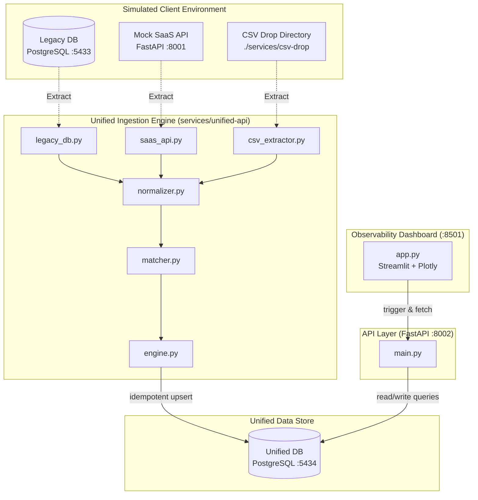

# MessyData: Enterprise CRM Consolidation Platform

[](#)
[](#)

MessyData is a multi-source data integration platform built to simulate and solve the "integration wall" commonly encountered in real-world enterprise deployments. Instead of assuming clean data pipelines, this project implements a production-grade ingestion and reconciliation engine to consolidate fragmented and corrupted customer records across three disconnected sources.

---

## 1. CRM Consolidation Scenario

A fictional enterprise has acquired a competitor and needs to reconcile customer profiles across three disparate systems:

1. **Legacy CRM (PostgreSQL)**
   * **Attributes**: A denormalized database with inconsistent capitalization, transposed name components (e.g., `LAST, FIRST`), duplicates, and missing (`NULL`) email fields.
2. **Modern SaaS CRM (REST API)**
   * **Attributes**: A cloud REST CRM with paginated results, sliding-window rate limiting, intermittent internal server errors, and domain-drifted emails (e.g., corporate vs. public webmails).
3. **Sales Team CSV Exports**
   * **Attributes**: Hand-maintained spreadsheets from regional divisions containing spelling mistakes, different date formats (e.g., `MM/DD/YYYY` vs. `DD-MM-YYYY`), varying header names, and alternative encodings (e.g., Latin-1/Windows-1252 with accented characters like René and Zoë).

---

## 2. System Architecture

The architecture diagram below displays the completed data ingestion, reconciliation engine, REST API gateway, and dashboard interaction flow:



---

## 3. Directory Structure

```text
MessyData/
├── .github/
│   └── workflows/
│       └── ci.yml                     # GitHub Actions CI workflow config
├── docker-compose.yml                 # Orchestrates all multi-container services
├── README.md                          # [THIS FILE] Project overview & documentation
├── docs/                              # Project design docs and guides (not committed)
│   ├── MessyData_PRD.txt
│   ├── phase1_explanation.md
│   ├── phase2_explanation.md
│   ├── phase3_explanation.md
│   ├── phase4_explanation.md
│   ├── phase5_explanation.md
│   └── resume_bullets.md              # Metrics-driven FDE resume points
├── scripts/
│   ├── generate_messy_data.py         # Mock data generator and corrupter
│   └── verify_extraction.py           # Verification script for extraction connectors
└── services/
    ├── csv-drop/                      # Folder containing regional sales CSV exports
    ├── dashboard/                     # Streamlit frontend application dashboard
    ├── legacy-db/                     # PostgreSQL instance for messy legacy CRM
    ├── mock-saas-api/                 # FastAPI REST API simulating third-party CRM
    ├── unified-api/                   # FastAPI gateway and Ingestion engine
    │   ├── tests/                     # Unit test suites (normalizers, matchers)
    │   │   └── test_pipeline.py
    │   └── pipeline/
    │       └── connectors/            # Ingestion connectors
    │           ├── csv_extractor.py
    │           ├── legacy_db.py
    │           └── saas_api.py
    └── unified-db/                    # PostgreSQL instance for reconciled golden records
```

---

## 4. REST API Endpoint Catalog

The Unified API gateway (`services/unified-api`) exposes the following endpoints:

| Method | Endpoint | Description | Sample Request/Response Payload |
| :--- | :--- | :--- | :--- |
| `POST` | `/pipeline/run` | Triggers background ETL pipeline extraction and reconciliation. | Returns `{"run_id": "...", "status": "started"}` |
| `GET` | `/pipeline/runs` | Fetches runs history, start times, and telemetry. | Returns list of run telemetry objects (counts, timestamps) |
| `GET` | `/pipeline/flagged` | Retrieves all unresolved matching duplicate record blocks. | Returns list of conflicting customer record sets |
| `POST` | `/pipeline/resolve` | Manually resolves duplicate sets (`merge` fields or `create` separate profiles). | Request: `{"flagged_id": 1, "action": "merge", "merged_fields": {...}}` |
| `GET` | `/customers` | Searches golden records using fuzzy name/email filters. | Query parameters: `q=john`, `limit=20`, `offset=0` |
| `GET` | `/customers/{id}` | Fetches detailed golden record profile and its source provenance lineage. | Returns profile mapping with origins from legacy, saas, or CSV |

---

## 5. Technology Stack

* **Orchestration / Containers**: Docker & Docker Compose (`docker-compose.yml`)
* **Ingestion API & Mock API**: FastAPI, Uvicorn, Requests
* **Databases**: PostgreSQL (15-alpine) + SQLAlchemy (Connection Pooling)
* **Resiliency & Retries**: Tenacity (Exponential backoff with jitter)
* **Fuzzy Matching**: RapidFuzz (Token similarity token-sort comparisons)
* **Data Processing**: Pandas, Native Python CSV
* **Observability Dashboard**: Streamlit (Python) + Plotly (Stacked bar charts)
* **Structured Logging**: Custom JSON Logging Formatter (`logging_config.py`)
* **Unit Testing**: Python Standard `unittest` Library
* **CI/CD**: GitHub Actions (`ci.yml`)

---

## 6. Getting Started & Verification

### Prerequisites

Ensure you have Python 3.10+ and Docker / Docker Compose installed on your system.

### Step 1: Generate Mock CRM Data

Run the generator script to seed the legacy database init files, mock SaaS API, and CSV files:

```bash
python scripts/generate_messy_data.py
```

### Step 2: Spin Up Container Infrastructure

Launch all databases, REST APIs, unified API engines, and dashboard containers:

```bash
docker compose up --build -d
```

### Step 3: Run Unit Tests

Execute the automated test suite locally to verify normalizer and matcher scores:

```bash
# Inside host or test environment:
python -m unittest discover -s services/unified-api/tests -p "test_*.py"

# Or run directly inside the running Docker container:
docker compose exec unified-api python -m unittest discover -s tests -p "test_*.py"
```

### Step 4: Run Extraction Verification

Verify that the connectors successfully read all 1,230 records across the target sources:

```bash
python scripts/verify_extraction.py
```

### Step 5: Access the Dashboard

Navigate to **`http://localhost:8501`** in your browser to:
1. **Trigger Ingestion**: Click the *Trigger Ingestion Run* button in the sidebar.
2. **Explore Directory**: Search golden customer files and click on rows to trace their data provenance and see which sources (e.g. legacy DB, REST API, CSV) contributed to the record.
3. **Resolve Conflicts**: Open the *Flagged Duplicates Review* tab to merge records or split profiles side-by-side.

---

## 7. Implementation Roadmap

- [x] **Phase 1: Foundations**
  * Set up Docker Compose networks, PostgreSQL instances, and mock data generators.
- [x] **Phase 2: Source Connectors**
  * Build database, REST API, and encoding-safe CSV extractors.
- [x] **Phase 3: Reconciliation Engine**
  * Implement fuzzy matching thresholds, name/email normalization, and idempotent database loading.
- [x] **Phase 4: Unified API Layer**
  * Construct FastAPI endpoints to expose unified records and pipeline histories.
- [x] **Phase 5: Observability Dashboard**
  * Build Streamlit dashboard showcasing run trends, dedup statistics, and flagged review records.
- [x] **Phase 6: Final Polish & CI/CD**
  * Integrate GitHub Actions workflow tests and finalize container health checks.
